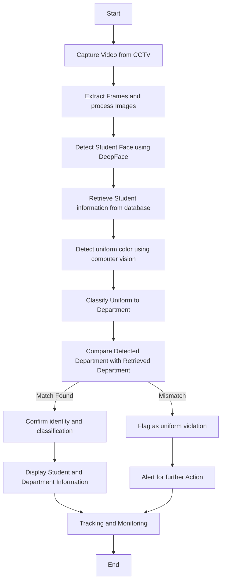

# Intelligent Surveillance and Identification for Secure Campus
This project aims to develop an AI-based system that detects and classifies students into their
respective departments based on their uniform color. The model will process video footage
from CCTV cameras, applying color segmentation techniques to determine the department,
thereby eliminating the need for manual verification. Additionally, the system will integrate
face detection to retrieve student-related confidential details, enabling real-time identification
and tracking of individuals when necessary. This AI-driven surveillance and monitoring
system enhances campus security, ensures uniform compliance, and provides an efficient way
to manage student activities.

## Objective
The objective of this project is to:
- Develop a Computer Vision model for detecting uniform colors.
- Use the DeepFace model to detect face.
- Implement a classification algorithm to associate detected colors with specific departments.
- Integrate face detection to a querying system, to query the student related data from the database.

# Research gap
Ensuring that students comply with the university’s uniform policy is difficult with current manual methods. These methods are making it difficult to identify unauthorized individuals who may enter the university by pretending to be valid students. 

These are the limitations highlighting the need for an AI based approach:
- To achieve the same, already known methods rely on image data, but don’t give good accuracy using video data.
- Models combining face detection system and uniform checking system together is found publicly, which hallucinate frequently making it an inefficient model.
- Over this integrating a database successfully that queries the correct information is a big deal that requires quality data and better parameters.

## Methodology
This project follows a structured approach to detecting and classifying students using Computer Vision and Deep Learning. The system processes video footage from CCTV cameras to detect students' faces and retrieve their information from a database while simultaneously analyzing their uniforms to classify them into their respective departments. A key aspect of this system is uniform verification, ensuring that a student's detected uniform matches their registered department. If a mismatch occurs, the system flags the discrepancy for further action.

### Block Diagram

The process involved in model training and implementation is as follows:

1. Video Acquisition : Capture student video footage from CCTV cameras for real-time analysis, ensuring continuous monitoring and data collection across multiple locations.
2. Frame Extraction & Preprocessing : Extract frames from video, enhance image quality, reduce noise, and normalize colors for consistent processing, improving model accuracy and robustness.
3. Face Detection & Student Identification : Utilize the DeepFace model to detect student faces, compare them against a stored database, and retrieve relevant student information such as name, department, and enrollment details, ensuring accurate identification.
4. Uniform Detection & Color Segmentation : Apply Computer Vision techniques to extract the dominant uniform color from detected students, using adaptive color thresholding for precision.
5. Department Classification : Match the extracted uniform color to predefined department mappings to determine the expected department and validate compliance with uniform policies.
6. Uniform Verification & Discrepancy Detection : Compare the retrieved department from face recognition with the classified department from uniform detection:
    - If the uniform matches the student’s registered department, the system confirms a correct classification.
    - If the uniform does not match the student's registered department, the system flags the student for potential uniform violation or may be an intruder.
7. Tracking & Result Display : Display student information, classified department, and uniform verification status on a centralized dashboard for monitoring, real-time decision-making, and generating reports for administrative use.

## Future Scope
This project lays the groundwork for AI-driven surveillance and student monitoring, focusing
on detection, identification, and system integration. Future developments include an
Automated Attendance System using facial recognition and uniform verification,
eliminating manual roll calls. A Campus-Wide Surveillance Network will enhance security
by monitoring movements and detecting unauthorized individuals. Real-Time Alerts will
notify authorities of unauthorized access, while Behavioral Analysis will detect anomalies
like loitering or group conflicts. Integration with University Management Systems will
automate records, security checks, and access control. AI-Powered Uniform Enforcement
will ensure compliance by identifying dress code violations. By leveraging AI advancements,
this system aims to be a comprehensive, intelligent solution for campus security and student
management.

## Conclusion
This project presents an AI-based solution for student classification and identification by
leveraging computer vision and deep learning techniques. By integrating uniform color
detection and face recognition, the system ensures accurate department classification and
enables real-time identity verification. The adoption of CCTV-based video analysis
overcomes the inefficiencies of traditional manual methods, enhancing campus security and
uniform compliance. Furthermore, the integration of a querying system with face detection
provides seamless access to student-related data, making the system a robust tool for
university administration. This AI-driven approach addresses existing research gaps and sets a
foundation for future advancements in automated surveillance and student monitoring
systems.

## References
1. Lam, Khang & La, Trong & Nguyen, Khang & Le, Man & Truong, Vy & Ware,
Andrew. (2023). Monitoring Attendance and Checking School Uniforms Using
YOLOv8. 10.1007/978-981-99-7649-2_15.
2. R, Poorni & S, Charulatha & B, Amritha & P, Bhavyashree. (2022). Real-Time Face
Detection and Recognition Using Deepface Convolutional Neural Network. ECS
Transactions. 107. 5091-5103. 10.1149/10701.5091ecst.
3. Unuriode, Austine & Yusuf, Babatunde & Durojaiye, Olalekan & Okunade, Lateef.
(2023). The Integration Of Artificial Intelligence Into Database Systems (Ai-Db
Integration Review). International Journal on Cybernetics & Informatics. Vol 12.
10.5121/ijci.2023.1206012.
4. Rahmaniar, Wahyu & Hernawan, Ari. (2021). Real-Time Human Detection Using
Deep Learning on Embedded Platforms: A Review. Journal of Robotics and Control
(JRC). 2. 10.18196/jrc.26123.
5. Ibrahim, Sutrisno. (2016). A comprehensive review on intelligent surveillance
systems. Communications in Science and Technology. 1. 10.21924/cst.1.1.2016.7.
